# TrGAN

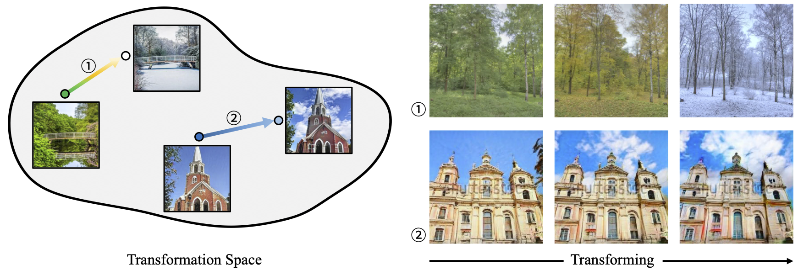

*Given an image pair, TrGAN is able to project them onto the learned transformation space and further extract the semantic variation between them to transform new images.*

> **Unsupervised Image Transformation Learning via Generative Adversarial Networks** <br>
> Kaiwen Zha, Yujun Shen, Bolei Zhou <br>
> *arXiv preprint arXiv: 2103.07751*

[[Paper](https://arxiv.org/pdf/2103.07751.pdf)]
[[Project Page](https://genforce.github.io/trgan/)]
[[Demo](https://www.youtube.com/watch?v=ZTYLihZYwYM)]

In this repository, we propose an unsupervised learning framework, termed as TrGAN, to project images onto a transformation space that is shared by the generator and the discriminator. Any two points in this projected space define a transformation that can guide the image generation process. TrGAN is able to adequately extract the semantic variation between a given image pair and further apply the extracted semantic to facilitating image editing. Some results are shown below.

## Results on Transforming Images

| Changing Season | | | | |
| :-: | :-: | :-: | :-: | :-: |
| Source | Target | Sample 1 | Sample 2 | Sample 3
| 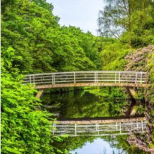 | 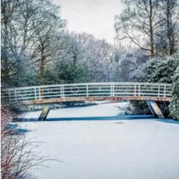 | 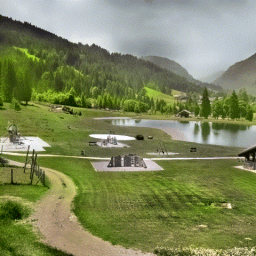 | 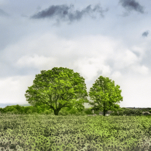 | 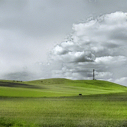

| Adding Clouds | | | | |
| :-: | :-: | :-: | :-: | :-: |
| Source | Target | Sample 1 | Sample 2 | Sample 3
| 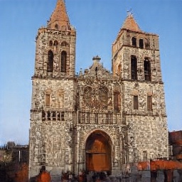 | 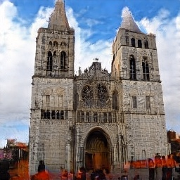 | 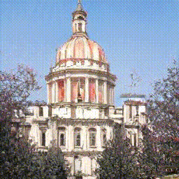 | 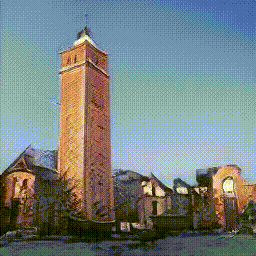 | 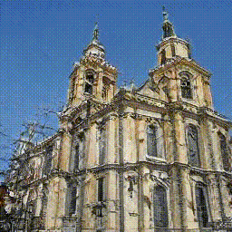

| Altering Shape | | | | |
| :-: | :-: | :-: | :-: | :-: |
| Source | Target | Sample 1 | Sample 2 | Sample 3
| 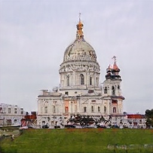 |  | 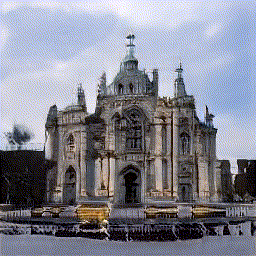 | 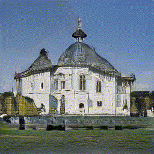 | 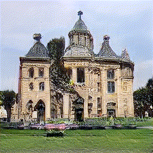

## BibTeX

```bibtex
@article{zha2021unsupervised,
  title   = {Unsupervised Image Transformation Learning via Generative Adversarial Networks},
  author  = {Zha, Kaiwen and Shen, Yujun and Zhou, Bolei},
  journal = {arXiv preprint arXiv:2103.07751},
  year    = {2021}
}
```

## Code Coming soon
